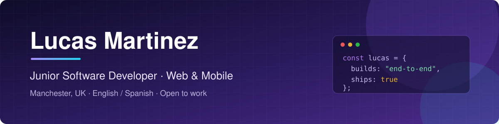

  

  
  
  

  
  
  
  
  

---

## 👋 About me

I'm a recent graduate in **Multiplatform Application Development** (DAM — UK equivalent: RQF Level 5 / HND), fully bilingual in English and Spanish.

I learn best by building real, working products end to end rather than following isolated tutorials. Every project below was designed, coded, tested and shipped by me — mistakes included — and most of them are live and playable right now.

- 🎯 **Looking for:** my first full-time Junior Developer role in the UK
- 🧭 **Open to:** front-end, full-stack or mobile — I pick up new stacks quickly
- 🛠️ **How I work:** small focused commits, automated CI and deploys with GitHub Actions, clear READMEs, and code a teammate can pick up

---

## 🚀 Featured projects

<table>
  <tr>
    <td width="50%" valign="top">
      
      <h3>OneDay</h3>
      
Data-driven decision game: pick one of six eras, live a single day one decision card at a time, and discover who your choices made you. Bilingual (EN/ES) with an automated test suite.

      
<b>Vanilla JS (ES modules) · HTML · CSS · Firebase</b>

      
 

    </td>
    <td width="50%" valign="top">
      
      <h3>MasterCinema</h3>
      
Film trivia game with five categories, a timed Marathon Mode with streaks and lifelines, unlockable themes, cloud accounts and a global leaderboard.

      
<b>Vanilla JS · React + TypeScript + Tailwind · Firebase</b>

      
 

    </td>
  </tr>
  <tr>
    <td width="50%" valign="top">
      
      <h3>RetroGames</h3>
      
80s-style arcade portal with six classics built on the Canvas API — Snake, Pac-Man, Tetris, Breakout, Space Invaders and Asteroids — plus coins, achievements, a global ranking and cloud saves.

      
<b>Vanilla JS · Canvas API · HTML · CSS · Firebase</b>

      
 

    </td>
    <td width="50%" valign="top">
      

        
        
        
      

      <h3>PawMatch</h3>
      
Mobile app that matches dogs and their owners for breeding, playdates and walking buddies. Layered architecture (models → services → providers → screens), ready to swap mock data for Firebase.

      
<b>Flutter · Dart · Provider · Firebase</b>

      

    </td>
  </tr>
</table>

  Also: my <a href="https://lucasmarjua-ui.github.io/"><b>portfolio site</b></a> — React, TypeScript, Vite and Tailwind CSS, deployed to GitHub Pages
  (<a href="https://github.com/lucasmarjua-ui/lucasmarjua-ui.github.io">code</a>).
   
  Each repository has its own README with screenshots, architecture notes and the reasoning behind each build.

---

## 🛠️ Tech stack

**Languages**

  
  
  
  
  
  
  

**Front-end & mobile**

  
  
  
  
  
  

**Back-end & data**

  
  
  

**Tools & workflow**

  
  
  
  

---

## 📫 Get in touch

Available immediately for full-time roles — based in Manchester, UK.

- 📧 **Email:** [lucas.mar.jua@gmail.com](mailto:lucas.mar.jua@gmail.com)
- 💼 **LinkedIn:** [Lucas Martinez](https://www.linkedin.com/in/lucas-martinez-a4b955406/)
- 🌐 **Portfolio:** [lucasmarjua-ui.github.io](https://lucasmarjua-ui.github.io/)
